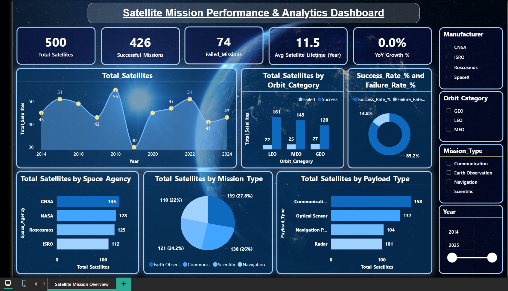

# 🚀 Satellite Mission Performance & Analytics Dashboard

## 📌 Project Overview

This project is an interactive Power BI dashboard developed to analyze global satellite missions and their performance. It provides insights into satellite launches, mission success rates, payload types, orbit categories, and space agencies through dynamic visualizations.

---

## 🛠 Tools Used

- Power BI
- Power Query
- DAX
- Excel
- Data Visualization

---

## 📊 Dashboard Features

- KPI Cards
- Interactive Slicers
- Line Chart
- Donut Chart
- Bar Charts
- Orbit Category Analysis
- Payload Type Analysis
- Mission Type Analysis

---

## 📈 Key KPIs

- Total Satellites
- Successful Missions
- Failed Missions
- Average Satellite Lifetime
- YoY Growth %

---

## 🖼 Dashboard Preview

---

## 💡 Key Insights

- Overall Success Rate: **85.2%**
- LEO orbit has the highest successful missions.
- Communication satellites are the most common payload type.
- CNSA has the highest number of satellites in the dataset.
- Interactive filters allow analysis by Year, Manufacturer, Orbit Category, and Mission Type.

---

## 📂 Files Included

- Power BI Dashboard (.pbix)
- Dataset (.xlsx/.csv)
- Dashboard Screenshot
- README Documentation

---

## 👨‍💻 Author

**Prashik Meshram**

Aspiring Data Analyst

SQL | Python | Power BI | Tableau | Excel
